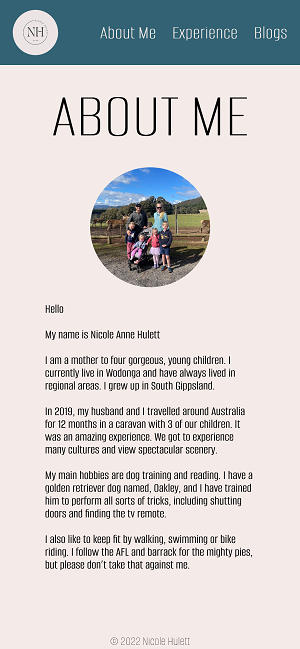

# T1A2 Portfolio Documentation

### [Portfolio Website](https://fantastic-bunny-4ba841.netlify.app)

### [GitHub Repo](https://github.com/Coder-Nicki/NicoleHulett_T1A2)

### [Slidedeck Presentation](https://youtu.be/UNmaJwRfl-8)

***

## Purpose
The purpose of my portfolio is to to showcase my web development skills to potential employers.

***

## Functionality/Features
I have created a portfolio website that is responsive to all screen sizes, including mobile, tablet and desktop so that it is asscessible for everyone. I have utilised a simple design throughout the website, with small parts showing off different CSS skills I have learnt. The web site includes four main pages.

- Home page: This is the landing page when viewing the website. It can also be accessed by clicking on my logo in the top left corner in the header. This page features a circular profile picture and links to my social pages.

- About Me: This page can be accessed by a link in the nav bar in the header. This page hopes to give people a glimpse into who I am. This page uses a media breakpoint to change the layout out for tablet and desktop viewers, so al information can be seen on the page.

- Experiences: This page is again accessed by the navigation bar. This page highlights my work experience up until this point in time. On this page, I have also put in a background image sourced from unsplash. On this page I have also included a link to my resume and have styled the link like a button.

- Blogs: This page provides a list of blogs about dogs. Each blog item is on a separate card with a picture, title and date. The title of each is a link to the actual blog post. The layout of this page changes according to the device the user is viewing on. In desktop mode, the blog cards are displayed across in one row, whereas in mobile view, they are displayed in one column.

***

## Sitemap

.png)

## Screenshots

***

# Wireframes

# Desktop view

# Tablet view

# Mobile view

## Target Audience
My target audience is for prospective employers. 

***

## Tech Stack
- I have used HTML and CCS for the website through the text editor VS code.
- I completed the site map on draw.io. 
- The wireframes were created on Figma. 
- I deployed the website with Netifly.

***